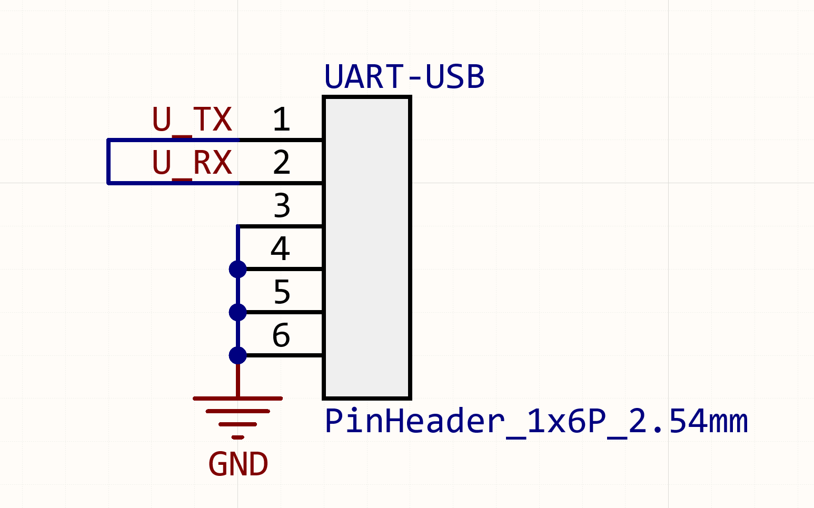

# serial_port_win32

A SerialPort library using win32 API. 

[](https://pub.dev/packages/serial_port_win32)

## Getting Started

### Get Ports

```dart
final ports = SerialPort.getAvailablePorts();
print(ports);
/// result like [COM3, COM4]
```

### Get Ports with more messages

```dart
final List<PortInfo> ports = SerialPort.getPortsWithFullMessages();
print(ports); 
/// print [Port Name: COM3, FriendlyName: 蓝牙链接上的标准串行 (COM3), hardwareID: BTHENUM\{00001101-0000-1000-8000-00803f9b55fb}_LOCALMFG&0000, manufactureName: Microsoft]
PortInfo({
required this.portName,
required this.friendlyName,
required this.hardwareID,
required this.manufactureName,
required this.deviceInstanceId,
});
```

### Create Serial Port Instance

The port instance is **Singleton Pattern**. Don't re-create port for same Com name.

```dart
final port = SerialPort("COM5", openNow: true, ByteSize: 8, BaudRate: 9600);
// or
final port = SerialPort("COM5", openNow: false, ByteSize: 8, BaudRate: 9600);
port.open();
// or
port.openWithSettings(BaudRate: CBR_115200);
// final port = SerialPort("COM5"); /// auto open with default settings
```

### Read

There are several methods to read bytes from serial port.

- `readBytesUntil`
  - [readBytesUntil] will read until an [expected] sequence is found
- `readBytes`
  - General Read with the timeout parameter.
- `readFixedSizeBytes`
  - [readFixedSizeBytes] will always read until readData.length == bytesSize.

```dart
print(await port.readBytesUntil(Uint8List.fromList("T".codeUnits))); /// '\0' is not included
/// or
var read = port.readBytes(18, timeout: Duration(milliseconds: 10))..then((onValue) => print(onValue));
var result = await read;
print(result);
/// or
var fixedBytesRead = port.readFixedSizeBytes(2)..then((onValue) => print(onValue));
await fixedBytesRead;
/// see more in small example
```

### Write

#### Write String

```dart
String buffer = "hello";
await port.writeBytesFromString(buffer, includeZeroTerminator: false, stringConverter: StringConverter.nativeUtf8);
```

#### Write Uint8List

```dart
final uint8_data = Uint8List.fromList([1, 2, 3, 4, 5, 6]);
print(await port.writeBytesFromUint8List(uint8_data));
```

### Get Port Connection Status

```dart
port.isOpened == false;
```

### Flow Control

```dart
port.setFlowControlSignal(SerialPort.SETDTR);
port.setFlowControlSignal(SerialPort.CLRDTR);
```

### Close Serial Port

#### Close Without Listen

```dart
port.close();
```

#### Close On Listen

```dart
port.closeOnListen(
  onListen: () => print(port.isOpened),
)
  ..onError((err) {
    print(err);
  })
  ..onDone(() {
    print("is closed");
    print(port.isOpened);
  });
```

### Attention

- If you want to read or write strings using serial, be careful to handle the terminator at the end.
  - Although in most cases, like "Hello\0" (68 65 6C 6C 6F 00) and "Hello"(68 65 6C 6C 6F) both can be identified by computer.

- Do not use hot restart when port is opened.

### Small Example

```dart
import 'package:serial_port_win32/src/serial_port.dart';

void main() {
    var ports = SerialPort.getAvailablePorts();
    print(ports);
    if(ports.isNotEmpty){
      var port = SerialPort(ports[0]);
      port.BaudRate = CBR_115200;
      port.StopBits = ONESTOPBIT;
      port.close();
    }
}

void _send() async {
  if (!port.isOpened) {
    port.open();
  }

  print('⬇---------------------------- general read (read <=  18 bytes)');
  await port.writeBytesFromString("😄我AT",
      includeZeroTerminator: false,
      stringConverter: StringConverter.nativeUtf8);
  var read = port.readBytes(18, timeout: Duration(milliseconds: 10))
    ..then((onValue) => print(onValue));
  await Future.delayed(Duration(milliseconds: 5));
  await port.writeBytesFromString("😄我AT",
      includeZeroTerminator: false,
      stringConverter: StringConverter.nativeUtf8);
  Uint8List readUint8List = await read;
  print('await result: $readUint8List');

  print(
          '⬇---------------------------- time out read,try to read **18 bytes** data in queue (read <= 18 bytes)');
  await port.writeBytesFromString("😄AT",
          includeZeroTerminator: false,
          stringConverter: StringConverter.nativeUtf8);
  var timeOutRead = port.readBytes(18, timeout: Duration(milliseconds: 10))
    ..then((onValue) => print(onValue));
  /// timeout
  await Future.delayed(Duration(milliseconds: 15));
  await port.writeBytesFromString("😄我AT",
          includeZeroTerminator: false,
          stringConverter: StringConverter.nativeUtf8);

  await timeOutRead;

  print('⬇---------------------------- read successful without timeout, but you just want 8 bytes (read <= 8 bytes)');
  await port.writeBytesFromString("😄AT",
      includeZeroTerminator: false,
      stringConverter: StringConverter.nativeUtf8);
  var wantedBytesRead = port.readBytes(8, timeout: Duration(milliseconds: 10))
    ..then((onValue) => print(onValue));
  await port.writeBytesFromString("😄我AT",
      includeZeroTerminator: false,
      stringConverter: StringConverter.nativeUtf8);

  await wantedBytesRead;

  print('⬇---------------------------- read until specified fixed size (2 bytes), it may cause deadlock (read == 2 bytes)');
  await port.writeBytesFromString("😄AT",
      includeZeroTerminator: false,
      stringConverter: StringConverter.nativeUtf8);
  var fixedBytesRead = port.readFixedSizeBytes(2)
    ..then((onValue) => print(onValue));
  await port.writeBytesFromString("😄我AT",
      includeZeroTerminator: false,
      stringConverter: StringConverter.nativeUtf8);

  await fixedBytesRead;

  port.close();
}
```

## Tested Ciruit

The code is tested by a UART-USB Conveter. **TX** and **RX** are connected together for local loopback.


